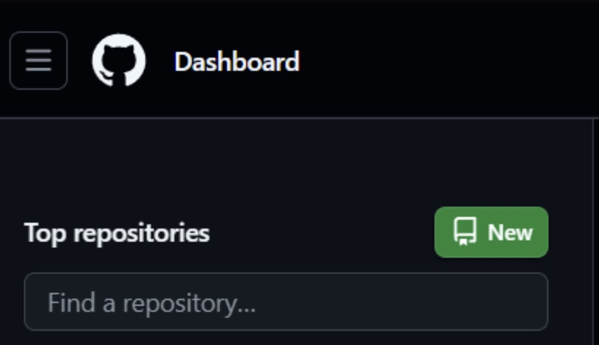

# Informe de laboratorio — Lab_01
## Git, GitHub y Visual Studio Code

**Curso:** Introducción a Señales Biomédicas
**Ciclo:** 2026-II
**Grupo:** 5

---

## Índice

1. [Introducción](#1-introducción)
2. [Objetivos](#2-objetivos)
3. [Marco teórico](#3-marco-teórico)
4. [Procedimiento](#4-procedimiento)
5. [Resultados y evidencias](#5-resultados-y-evidencias)
6. [Buenas prácticas y recomendaciones](#6-buenas-prácticas-y-recomendaciones)
7. [Referencias](#7-referencias)

---

## 1. Introducción

En el desarrollo de proyectos de ingeniería biomédica que involucran programación, procesamiento de señales y trabajo colaborativo, es indispensable contar con un sistema de control de versiones que permita registrar cambios, coordinar el trabajo en equipo y mantener un historial ordenado del proyecto. En este laboratorio se trabajaron los fundamentos de **Git** como herramienta de control de versiones local, **GitHub** como plataforma de alojamiento remoto y colaboración, y la integración de ambos dentro del editor **Visual Studio Code (VS Code)**, con el fin de establecer el flujo de trabajo que el equipo utilizará durante todo el curso para documentar laboratorios, informes y el proyecto final.

## 2. Objetivos

- Comprender la diferencia conceptual entre Git y GitHub.
- Instalar y configurar Git en el entorno de trabajo local.
- Aplicar el flujo básico de Git: `init`, `add`, `commit`, `status`, `log`.
- Crear y gestionar ramas (*branches*) para trabajo paralelo y experimentación segura.
- Resolver conflictos de fusión (*merge conflicts*).
- Vincular un repositorio local con uno remoto en GitHub, incluyendo el uso de VS Code para publicar y sincronizar cambios.
- Establecer el flujo de trabajo colaborativo que el grupo usará en el repositorio `GRUPO5-ISB-2026-II`.

## 3. Marco teórico

### 3.1. Git vs. GitHub

Aunque suelen mencionarse juntos, cumplen roles distintos:

| | **Git** | **GitHub** |
|---|---|---|
| Qué es | Sistema de control de versiones | Plataforma en la nube para alojar repositorios Git |
| Dónde funciona | Localmente, en la computadora del usuario | En línea, permite colaboración remota |
| Enfoque | Registrar el historial de cambios de los archivos | Alojar el repositorio y facilitar el trabajo en equipo |

En otras palabras: **Git es la herramienta**, instalada en el equipo local, que registra el historial de un proyecto; **GitHub es la plataforma** donde ese historial puede alojarse en la nube para que varias personas colaboren sobre el mismo repositorio.

### 3.2. Las cuatro áreas de trabajo de Git

Git organiza un proyecto en cuatro áreas:

1. **Working Directory (directorio de trabajo):** donde se crean y editan los archivos.
2. **Staging Area (área de preparación):** zona intermedia donde se colocan los cambios antes de guardarlos permanentemente, mediante `git add`.
3. **Local Repository (repositorio local):** copia del proyecto con su historial completo de cambios en la computadora del usuario, actualizada mediante `git commit`.
4. **Remote Repository (repositorio remoto):** versión compartida del proyecto (en este caso, en GitHub), sincronizada mediante `git push`, `git fetch` y `git pull`.

El flujo típico entre estas áreas es:

```
Working Directory --(git add)--> Staging Area --(git commit)--> Local Repo --(git push)--> Remote Repo
```

Adicionalmente, `git checkout` permite moverse entre versiones o ramas, y `git merge` combina cambios de distintas ramas.

### 3.3. Ramas (branches)

Las ramas permiten trabajar sobre nuevas funcionalidades o correcciones sin afectar la rama principal (`main`), que debe mantenerse siempre estable. El flujo recomendado es: crear una rama → trabajar y hacer commits en ella → fusionarla (*merge*) de vuelta a `main` cuando el trabajo esté validado → eliminar la rama si ya no se necesita.

## 4. Procedimiento

### 4.1. Instalación y configuración de Git

Se instaló Git según el sistema operativo (Windows, Linux o macOS) y se verificó la instalación con:

```bash
git --version
```

Luego se configuró la identidad del usuario, necesaria para que cada commit quede asociado a su autor:

```bash
git config --global user.name "Tu Nombre"
git config --global user.email "tucorreo@upch.pe"
```

*(Insertar aquí captura de pantalla de la terminal mostrando `git --version` y `git config` ejecutados)*

### 4.2. Creación de un repositorio local

```bash
mkdir my-first-repo
cd my-first-repo
git init
```

### 4.3. Primer commit

```bash
echo "# My First Project" > README.md
git add README.md
git commit -m "Initial commit"
```

*(Insertar aquí captura de `git status` mostrando el archivo como *untracked* y luego como *staged*)*

### 4.4. Monitoreo del estado y del historial

- `git status` — muestra qué archivos cambiaron, cuáles están en *staging* y cuáles sin seguimiento.
- `git log` / `git log --oneline` / `git log --oneline --graph --decorate --all` — muestran el historial de commits, útil para visualizar ramas y fusiones.

Flujo típico de trabajo diario:

```bash
git status
git add <archivo>
git commit -m "Descripción del cambio"
```

### 4.5. Manejo de ramas

```bash
git branch nueva_rama          # crear rama
git checkout -b nueva_rama     # crear y cambiar en un solo paso
git checkout main              # volver a la rama principal
git branch -a                  # listar ramas locales y remotas
git branch -d nueva_rama       # eliminar rama (segura)
```

*(Insertar aquí captura mostrando `git branch` con las ramas del equipo, por ejemplo listando `main` y alguna rama de trabajo)*

### 4.6. Fusión de ramas (merge) y resolución de conflictos

Fusión simple (*fast-forward*), cuando `main` no cambió desde que se creó la rama:

```bash
git switch main
git pull --ff-only
git merge nueva_rama
git push
```

Cuando ambas ramas tienen commits nuevos, Git genera un *merge commit*. Si aparecen conflictos, Git marca las secciones en conflicto con `<<<<<<<`, `=======` y `>>>>>>>` dentro del archivo; el usuario debe editar manualmente el archivo, elegir la versión correcta, y luego:

```bash
git add <archivo_resuelto>
git commit
git push
```

*(Insertar aquí captura o GIF mostrando un conflicto resuelto, si el equipo tuvo uno durante la práctica)*

### 4.7. Publicación del repositorio y conexión con GitHub

Para autenticar la terminal con GitHub se usó GitHub CLI:

```bash
gh auth login
```

siguiendo el flujo interactivo (selección de cuenta, protocolo HTTPS/SSH, autenticación vía navegador con código de un solo uso).

### 4.8. Integración con Visual Studio Code

1. Se abrió la carpeta del proyecto en VS Code.
2. En la pestaña **Source Control** se seleccionó **Initialize Repository**.
3. Al modificar archivos, estos aparecen listados como cambios pendientes; se escribió un mensaje de commit y se confirmó con el botón **Commit**.
4. Para publicar por primera vez, se usó **Publish Branch**, seleccionando el repositorio como **Public** o **Private**; VS Code configura automáticamente el remoto (`origin`) y sube (`push`) la rama `main`.
5. Para los commits siguientes, solo fue necesario **Commit** y luego **Sync Changes** (⇅).

*(Insertar aquí capturas de: panel de Source Control con "Initialize Repository", el botón "Publish to GitHub", y la ventana de autorización de la extensión de GitHub en VS Code)*

**Creación y cambio de ramas desde la interfaz de VS Code:** haciendo clic en el nombre de la rama en la barra de estado (inferior izquierda) → **Create new branch**.

**Fusión y resolución de conflictos desde VS Code:** desde `main`, menú **…** → **Merge Branch…**, seleccionando la rama a fusionar. Si hay conflictos, VS Code muestra marcadores en línea con botones **Accept Current / Accept Incoming / Accept Both**; tras resolver, se hace *stage*, *commit* y *push*.

**Auto-push tras cada commit (opcional):** en **Settings**, buscar *"Post Commit Command"* y configurar `Git › Post Commit Command` como `push`, de modo que cada commit se sincronice automáticamente con GitHub.

### 4.9. Trabajo con el repositorio remoto del grupo

Para sincronizar el repositorio `GRUPO5-ISB-2026-II` con los cambios del equipo:

```bash
git fetch --all              # actualiza referencias remotas
git pull --ff-only           # descarga y aplica cambios sin generar merges innecesarios
git branch -vv               # verifica qué rama remota sigue cada rama local
```

*(Insertar aquí captura del repositorio `GRUPO5-ISB-2026-II` en GitHub y/o de la terminal sincronizando cambios)*

## 5. Resultados y evidencias

*(En esta sección insertar las capturas de pantalla y/o GIFs propios del equipo que evidencien cada paso del procedimiento: creación del repositorio, commits realizados, ramas creadas, publicación desde VS Code, estructura final de carpetas del repositorio, etc. Se recomienda numerar las figuras, ej. "Figura 1. Inicialización del repositorio en VS Code".)*

**Figura 1. Inicialización del repositorio en VS Code.**

[


## 6. Buenas prácticas y recomendaciones

- Ejecutar `git status` con frecuencia, antes y después de modificar archivos.
- Mantener `main` siempre estable; realizar el trabajo experimental en ramas separadas.
- Usar nombres de rama descriptivos (ej. `feature/infografia`, `fix/readme`).
- Ejecutar `git fetch --all` antes de hacer `pull` para evitar sorpresas.
- Preferir `git pull --ff-only` para evitar *merge commits* innecesarios.
- Escribir mensajes de commit claros y descriptivos.
- Para archivos binarios grandes (`.pth`, `.ipynb`, `.png`, etc.), considerar Git LFS.


## 7. Referencias

- Meza, M. (2025). *Getting Started with Git and GitHub*. Material de clase, curso Introducción a Señales Biomédicas, UPCH.
- Documentación oficial de Git: [https://git-scm.com/doc](https://git-scm.com/doc)
- Documentación oficial de GitHub CLI: [https://cli.github.com/](https://cli.github.com/)
