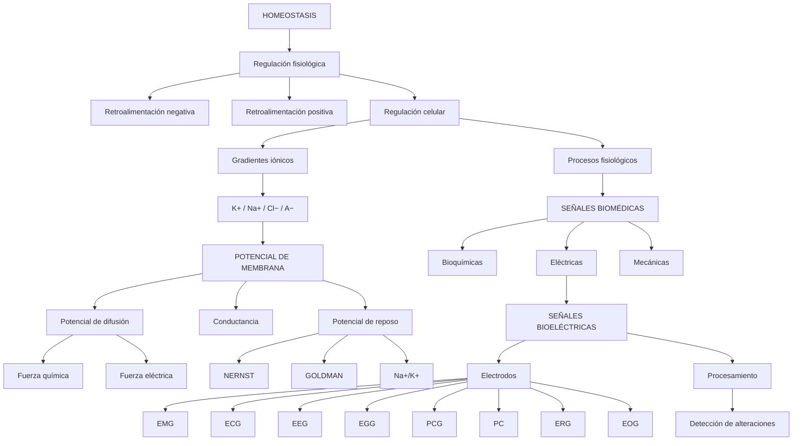

<div align="center">

# 🧬 Introducción a las Señales Biomédicas


**De la homeostasis celular a la adquisición y procesamiento de señales fisiológicas**

</div>


---

# 1. 🌐 Origen de las señales biomédicas

<div align="center">

## **HOMEOSTASIS**

> El cuerpo es una máquina biológica compleja que busca la conservación de la **HOMEOSTASIS**.

</div>

El cuerpo humano está formado por múltiples sistemas:

| Sistema | Ejemplo |
|---|---|
| 🫁 Respiratorio | Sistema respiratorio |
| ❤️ Cardiovascular | Sistema cardiovascular |
| 🧠 Nervioso | Sistema nervioso |

**Idea clave:** ningún sistema actúa de manera aislada.

Todos los sistemas trabajan en conjunto para mantener la correcta homeostasis, incluyendo el sistema nervioso autónomo y el sistema endocrino.

A nivel celular existe un **balance dinámico** que implica una regulación constante de concentraciones y gradientes.

Esto se logra mediante proteínas transmembrana que permiten el paso de materia como:

`glucosa · CO₂ · urea · aminoácidos · H₂O · iones`

Estos procesos implican un gasto energético relacionado con la oxidación mitocondrial y la generación de ATP.

---

# 2. 🔄 Retroalimentación

## Retroalimentación negativa

La retroalimentación negativa es un mecanismo de regulación en el que:


### **Objetivo**

Reducir los efectos de las acciones que provocaron el cambio inicial y restaurar el valor ideal.

**Secuencia:**

**Estímulo → Sensor → Centro de control → Efector → Respuesta opuesta**

---

## Retroalimentación positiva

En la retroalimentación positiva:


El cambio inicial activa respuestas que **refuerzan y amplifican ese mismo cambio**.

La secuencia creciente continúa hasta que:

- desaparece el estímulo, o
- se alcanza un evento final.

---

# 3. ⚡ POTENCIAL DE MEMBRANA

<div align="center">

## **POTENCIAL DE MEMBRANA**

</div>

Existe una diferencia de cargas iónicas entre el interior y el exterior de la célula.

### Polaridad celular

> **El interior es más negativo con respecto al exterior.**

Los principales iones considerados son:

| Ion | Ubicación predominante |
|---|---|
| **K⁺** | Interior |
| **A⁻** | Interior |
| **Na⁺** | Exterior |
| **Cl⁻** | Exterior |

### Importante

- K⁺ y A⁻ están más concentrados dentro.
- Na⁺ y Cl⁻ están más concentrados fuera.
- Todas las células están polarizadas.
- Estar polarizada **no significa** que toda célula pueda ser excitada.
- Solo algunas células especializadas pueden generar un cambio de voltaje.

---

# 4. 🧪 Distribución de K⁺, Na⁺, Cl⁻ y A⁻

<div align="center">

| 🧫 Interior celular | Membrana | 🌊 Exterior celular |
|:---:|:---:|:---:|
| **K⁺ ↑** | ║ | **Na⁺ ↑** |
| **A⁻ ↑** | ║ | **Cl⁻ ↑** |
| Más negativo | ║ | Más positivo |

</div>

### Distribución fundamental

```text
INTERIOR                         EXTERIOR

K⁺  ↑                            Na⁺ ↑
A⁻  ↑                            Cl⁻ ↑

        ║ MEMBRANA ║
```

Esta distribución genera gradientes de concentración entre el interior y el exterior.

---

# 5. 🌊 Potencial de difusión

<div align="center">

## **POTENCIAL DE DIFUSIÓN**

</div>

Es la diferencia de voltaje transmembrana generada cuando un tipo de ion se mueve **a favor de su gradiente de concentración**.

Para que un ion fluya, experimenta dos fuerzas:

| Fuerza | Depende de |
|---|---|
| 🧪 **Fuerza química** | Gradiente de concentración |
| ⚡ **Fuerza eléctrica** | Fuerza electrostática |

### Fuerza química

Depende de la diferencia de concentraciones.

### Fuerza eléctrica

Depende de:

1. si el ion es anión o catión;
2. el potencial del compartimiento.

> **Las fuerzas pueden encontrarse desequilibradas.**

Ejemplo mostrado en clase:

**K⁺ está 40 veces más concentrado en el interior que en el exterior.**

---

# 6. ⚖️ Potencial de equilibrio y NERNST

<div align="center">

## **NERNST**

### Equilibrio entre las fuerzas que actúan sobre un ion

</div>

La presentación introduce el potencial de equilibrio dentro del análisis del potencial de membrana y de los gradientes iónicos.

> **Nota:** La diapositiva proporcionada no muestra en el texto extraído la expresión matemática de la ecuación de Nernst.

Por lo tanto, para mantener la infografía estrictamente basada en el material de clase, **no se incorpora una fórmula externa de Nernst**.

### Idea central

```text
Gradiente de concentración
          +
     Fuerza eléctrica
          ↓
  Potencial de equilibrio
```

---

# 7. 🔌 Conductancia de membrana

<div align="center">

## **CONDUCTANCIA (g)**

</div>

El camino para una corriente se conoce como un **conductor**.

En la membrana:

> **Los canales iónicos = conductores**

La capacidad de un conductor para transmitir una corriente es su **conductancia (g)**.

| Concepto | Unidad |
|---|---|
| Conductancia | **Siemens (S)** |

La presentación señala que la conductancia de un canal iónico es constante.

---

# 8. 🧠 Potencial de membrana en reposo y GOLDMAN

<div align="center">

## **GOLDMAN**

### Estimación del potencial de membrana en reposo

</div>

El potencial de membrana en reposo es:

> La diferencia de cargas entre el interior y el exterior de la célula **en la situación real**.

Depende de:

| Factor |
|---|
| Potencial de difusión de **Na⁺** |
| Potencial de difusión de **K⁺** |
| Bomba **Na⁺/K⁺ (ATPasa)** |

### Permeabilidad relativa

En reposo:

> La membrana es mucho más permeable al **K⁺** que al **Na⁺**.

Por ello:

**K⁺ → mayor conductancia**

La **ecuación de Goldman** permite estimar el potencial considerando la variación de permeabilidad de la membrana a los distintos iones.

---

# 9. 🔋 Bomba Na⁺/K⁺

<div align="center">

## **Na⁺/K⁺**

### Mantiene el potencial de membrana

</div>

La bomba Na⁺–K⁺ es una proteína que abarca la membrana.

En cada ciclo:

| Movimiento | Cantidad |
|---|---:|
| 🟢 Entrada de K⁺ | **2 K⁺** |
| 🔴 Salida de Na⁺ | **3 Na⁺** |

Además:

> Cada ciclo implica la eliminación de una carga positiva desde el interior de la célula.

### Función

**La bomba Na⁺/K⁺ mantiene el potencial de membrana.**

---

# 10. ⚡ Corriente de membrana y Ley de Ohm

<div align="center">

## **CORRIENTE DE MEMBRANA**

</div>

La membrana contiene canales iónicos que funcionan como conductores.

La capacidad de conducción se expresa mediante:

**Conductancia → g**

y se mide en:

**Siemens → S**

### Relación conceptual

```text
Potencial de membrana
          ↓
   Canales iónicos
          ↓
     Conductancia
          ↓
 Corriente de membrana
```

> **Nota:** El material proporcionado no presenta en el texto extraído una ecuación explícita identificada como "Ley de Ohm". Por ello no se añade una fórmula externa.

---

# 11. 🧬 SEÑALES BIOMÉDICAS

<div align="center">

## **SEÑALES BIOMÉDICAS**

</div>

El cuerpo humano posee múltiples sistemas y subsistemas que participan constantemente en procesos fisiológicos e intercambio de materia.

Algunos procesos están asociados con señales de **muy bajo potencial eléctrico** que reflejan su naturaleza y actividades.

A estas señales se les llama:

# **SEÑALES BIOMÉDICAS**

---

## Clasificación

| Tipo | Ejemplos |
|---|---|
| 🧪 **Bioquímicas** | Hormonas, neurotransmisores |
| ⚡ **Eléctricas** | Potenciales, corrientes |
| ⚙️ **Mecánicas** | Presión, temperatura |

<div align="center">

### **BIOFÍSICA**

</div>

---

# 12. 📡 Señales bioeléctricas y adquisición

<div align="center">

## **SEÑALES BIOELÉCTRICAS**

</div>

Las señales bioeléctricas son tipos específicos de señales biomédicas.

### ¿Cómo se obtienen?


Los **electrodos** graban las variaciones del potencial eléctrico generado por los procesos fisiológicos.

### ⚠️ Ruido

Las señales biomédicas pueden verse perjudicadas por **ruidos**, los cuales alteran o dificultan su lectura.

---

# 13. 📊 Principales señales biomédicas

<div align="center">

## **SEÑALES BIOMÉDICAS MÁS COMUNES**

</div>

| Señal | Nombre | Actividad / variable |
|:---:|---|---|
| **EMG** | Electromiograma | Actividad eléctrica de las células musculares |
| **ECG** | Electrocardiograma | Actividad eléctrica del corazón / células cardíacas |
| **EEG** | Electroencefalograma | Actividad eléctrica del cerebro |
| **EGG** | Electrogastrograma | Actividad eléctrica del estómago |
| **PCG** | Fonocardiograma | Grabación de audio de la actividad mecánica del corazón |
| **PC** | Pulso carotídeo | Presión de la arteria carótida |
| **ERG** | Electrorretinograma | Actividad eléctrica de las células de la retina |
| **EOG** | Electrooculograma | Actividad eléctrica de los músculos oculares |

---

## 🔎 Algunos ejemplos

### EMG

**Actividad eléctrica de las células musculares.**

### ECG

**Actividad eléctrica del corazón / células cardíacas.**

### EEG

**Actividad eléctrica del cerebro.**

### EGG

Mide los impulsos contráctiles que circulan por los músculos del estómago.

### PCG

Grabación de audio de la actividad mecánica del corazón.

### PC

Representa la presión de la arteria carótida.

### ERG

Registra la respuesta eléctrica de la retina ante destellos de luz.

### EOG

Actividad eléctrica de los músculos oculares.

---

# 14. 🩺 Importancia clínica

<div align="center">

## **DETECTAR ALTERACIONES FISIOLÓGICAS**

</div>

Observando las señales y comparándolas con sus normas conocidas, a menudo podemos detectar:

- enfermedades;
- trastornos;
- alteraciones fisiológicas.

Cuando las mediciones se observan durante un período de tiempo:

> Se obtiene una **serie temporal unidimensional** que representa una señal fisiológica.

---

## Ejemplos

| Alteración | Señal asociada |
|---|---|
| ❤️ Problema cardíaco | Cambios en **ECG** o presión arterial |
| 🧠 Trastornos neurológicos | Cambios en **EEG** |

### ERG

La presentación señala que el ERG permite:

- registrar la respuesta eléctrica de la retina;
- brindar diagnóstico de retinitis pigmentaria;
- realizar seguimiento de retinitis por retinopatía diabética.

---

# 15. 🧮 Procesamiento de señales biomédicas

<div align="center">

## **PROCESAMIENTO DE SEÑALES BIOMÉDICAS**

### Etapa final

</div>


El material de clase presenta el **procesamiento de señales biomédicas** como parte del trabajo con estas señales y lo relaciona con:

> **Digital Signal Processing: aplicación de algoritmos para el análisis de señales biomédicas.**

---

# 🧠 MAPA CONCEPTUAL FINAL



---

# 📌 CONCLUSIONES

<div align="center">

### **1**
La **HOMEOSTASIS** representa la conservación del equilibrio dinámico del organismo.

### **2**
La retroalimentación permite regular los cambios fisiológicos mediante mecanismos negativos o positivos.

### **3**
El **POTENCIAL DE MEMBRANA** surge de la distribución de cargas e iones entre el interior y exterior celular.

### **4**
Los gradientes iónicos, las fuerzas química y eléctrica, la conductancia y la bomba **Na⁺/K⁺** participan en el comportamiento eléctrico de la membrana.

### **5**
Las **SEÑALES BIOMÉDICAS** reflejan procesos fisiológicos y pueden ser bioquímicas, eléctricas o mecánicas.

### **6**
Las señales bioeléctricas pueden obtenerse mediante **electrodos** que registran variaciones del potencial eléctrico.

### **7**
El análisis de señales biomédicas permite observar cambios asociados con enfermedades y trastornos.

### **8**
El **procesamiento de señales biomédicas** permite trabajar con las señales registradas para su análisis.

</div>

---

# 📚 Referencias

Las siguientes referencias aparecen en el material de clase:

1. Prashant, P., Pal, S., Bansal, A., & Fotedar, S. *Nerve conduction velocity studies in diabetic peripheral neuropathy involving sural nerve—A meta-analysis*. Journal of Family Medicine and Primary Care, 13(10), 4469–4475, 2024. DOI: 10.4103/jfmpc.jfmpc_304_24.

2. Pan, T. F., Nandi, B., Campusano, R., Simon, A. J., Ziegler, D., Gazzaley, A., et al. *When more is not better: Predicting human emotional states with brain and bodily biosensors*. Biomedical Signal Processing and Control, 113, 109038, 2025.

3. Material adicional de clase:
   - Recursos audiovisuales indicados en la presentación.
   - Material visual y referencias utilizadas en las diapositivas.

---

<div align="center">

## 🧬 INTRODUCCIÓN A LAS SEÑALES BIOMÉDICAS

**HOMEOSTASIS → MEMBRANA → SEÑALES → ADQUISICIÓN → ANÁLISIS**

### Ingeniería Biomédica

</div>
