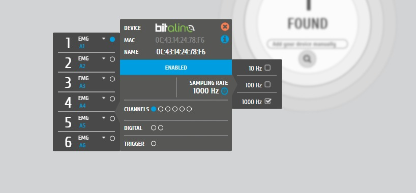
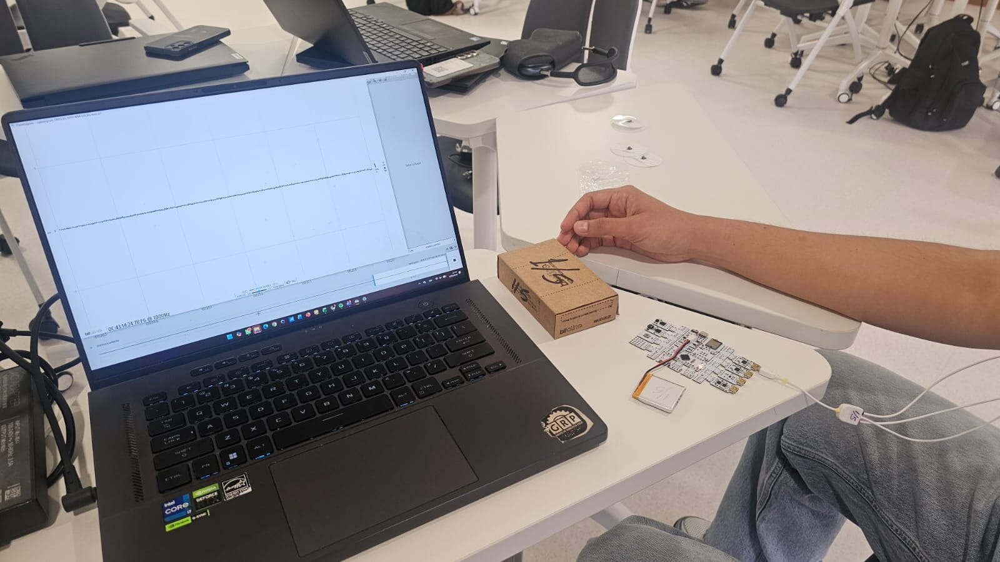
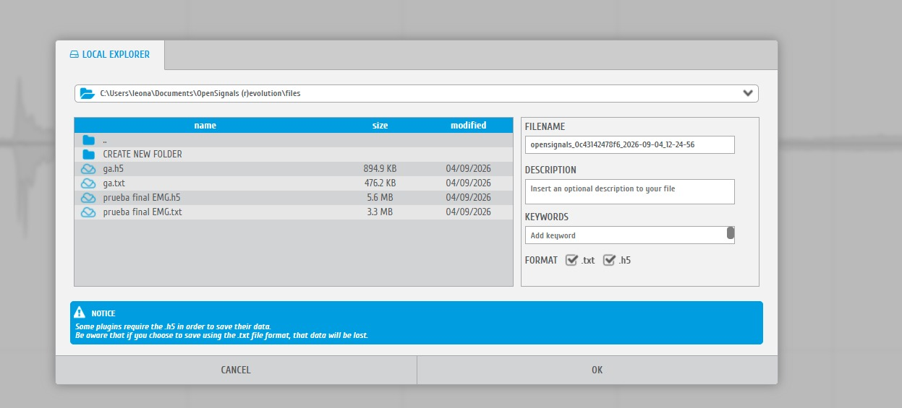

# **REPORTE: ANÁLISIS ELECTROMIOGRÁFICO (EMG) — Ploteo con Open Signals**

# **Tabla de contenidos**

1. [Resumen de mediciones](#id1)
2. [Resultados](#id2)\
     2.1 [Prueba 1 – Tríceps braquial (Leo)](#id3)\
     2.2 [Prueba 2 – Tríceps braquial (Kevin)](#id4)\
     2.3 [Prueba 3 – Bíceps braquial (Kevin)](#id5)\
     2.4 [Procedimiento de adquisición en OpenSignals](#id8)
3. [Discusión y comparativa](#id6)
4. [Conclusión](#id7)

## **Resumen de Mediciones** 

| Sujeto | Músculo Evaluado | Archivo de Origen | Frecuencia de Muestreo | Amplitud Máxima Aprox. |
|:------:|:-----------------:|:------------------:|:-----------------------:|:-----------------------:|
| **Leo** | Tríceps Braquial | `triceps leo.h5` | 1000 Hz | $\approx 1.5\text{ mV}$ |
| **Kevin** | Tríceps Braquial | `triceps kevin.h5` | 1000 Hz | $> 1.5\text{ mV}$ (Saturada) |
| **Kevin** | Bíceps Braquial | `biceps kevin.h5` | 1000 Hz | $> 1.5\text{ mV}$ (Saturada) |

---

## **RESULTADOS** 

Se registraron señales EMG crudas (sin filtrado) a $1000\text{ Hz}$ mediante el canal analógico $A1$ del BITalino, bajo un protocolo de reposo seguido de contracción voluntaria isométrica, sin carga externa. A continuación se presenta el ploteo de cada señal en Python junto con su observación correspondiente.

### **Prueba 1 – Tríceps braquial (Leo)** 

Señal registrada a partir del archivo <code>triceps leo.h5</code>, correspondiente a la contracción voluntaria del tríceps braquial del sujeto Leo.

> **Observación:** Curva progresiva con incremento gradual en el reclutamiento de fibras musculares. Alcanza un pico máximo claro cercano a $1.5\text{ mV}$ sin recortes en la señal.

---

### **Prueba 2 – Tríceps braquial (Kevin)** 

Señal registrada a partir del archivo <code>triceps kevin.h5</code>, correspondiente a la contracción voluntaria del tríceps braquial del sujeto Kevin.

> **Observación:** Señal con contracción de alta intensidad sostenida. Muestra saturación en los extremos superiores e inferiores al exceder el rango dinámico del sensor BITalino.

---

### **Prueba 3 – Bíceps braquial (Kevin)** 

Señal registrada a partir del archivo <code>biceps kevin.h5</code>, correspondiente a la contracción voluntaria del bíceps braquial del sujeto Kevin.

> **Observación:** Fase inicial de activación moderada seguida de un pico de esfuerzo máximo sostenido con reclutamiento completo y saturación de la señal.

---

### **Procedimiento de adquisición en OpenSignals** 

Previo al registro de las señales presentadas, se realizó el emparejamiento del dispositivo BITalino vía Bluetooth con el software OpenSignals (r)evolution, habilitándolo para iniciar la comunicación con la laptop.

Se configuró el canal analógico correspondiente al sensor EMG (A1), estableciendo una frecuencia de muestreo de <b>1000 Hz</b> para garantizar una adecuada resolución temporal de la señal mioeléctrica.

Se colocaron los electrodos de superficie sobre el vientre muscular evaluado, siguiendo la orientación de las fibras, junto con el electrodo de referencia (tierra) sobre una superficie ósea cercana.

Con el dispositivo conectado y los electrodos colocados, se inició la adquisición de la señal desde OpenSignals.

Durante la adquisición se visualizó en tiempo real la señal EMG cruda proveniente del canal A1, observándose el registro correspondiente a la fase de reposo previa a la contracción.

Al concluir el registro, la señal se guardó en formato <code>.h5</code> y <code>.txt</code> mediante el explorador local de archivos de OpenSignals, para su posterior análisis en Python.

---

## **Discusión y Comparativa** 

3.1 Condiciones de registro

Las tres señales corresponden a un protocolo de reposo seguido de contracción voluntaria isométrica, sin carga externa añadida, registradas en crudo (sin filtrado) a 1000 Hz a través del canal analógico A1 del BITalino. Al no haberse aplicado un filtro pasa-altas, las señales conservan componentes de baja frecuencia (deriva de línea base y posibles artefactos de movimiento de cable o electrodo) que normalmente se eliminarían con un corte cercano a 20 Hz.

3.2 Análisis por señal

Tríceps – Leo: La señal muestra una transición clara entre la fase de reposo (oscilaciones mínimas alrededor de 0 mV, atribuibles a ruido basal de fondo e interferencia electromagnética de la red eléctrica en torno a 50-60 Hz) y la fase de contracción voluntaria, donde se observa un incremento progresivo de la amplitud hasta un pico cercano a 1.5 mV. Este patrón de crecimiento gradual es consistente con el reclutamiento progresivo de unidades motoras: a medida que aumenta la demanda de fuerza, se activan más fibras y con mayor frecuencia de disparo, incrementando la amplitud de la envolvente EMG. Al no alcanzar el límite del rango dinámico del sensor, la señal conserva su morfología completa (sin clipping), lo que la hace apta para análisis cuantitativos posteriores (RMS, integral de la señal, mediana de frecuencia, etc.).

Tríceps – Kevin: A diferencia de Leo, la contracción de Kevin fue de alta intensidad sostenida, generando picos que superaron el rango de entrada del canal analógico. Esto se traduce en un aplanamiento o recorte (clipping) tanto en los picos positivos como negativos de la señal, ya que la forma de onda deja de seguir fielmente la actividad eléctrica real del músculo porque el ADC del BITalino satura su valor máximo o mínimo representable. Esta saturación no necesariamente indica una mayor activación muscular real respecto a Leo; solo confirma que la ganancia o rango configurado del sensor fue insuficiente para la intensidad de esfuerzo aplicada por este sujeto.

Bíceps – Kevin: Se observa una fase inicial de activación moderada (aumento gradual de la amplitud, similar al patrón visto en el tríceps de Leo) seguida de un tramo de esfuerzo máximo sostenido con reclutamiento muscular completo, donde nuevamente aparece saturación de la señal. El hecho de que ambas mediciones de Kevin (tríceps y bíceps) presenten clipping, mientras que la de Leo no, sugiere que el fenómeno está más relacionado con la intensidad de esfuerzo o fuerza de contracción del sujeto que con el músculo evaluado específicamente.

3.3 Comparativa entre sujetos y limitaciones

Las tres mediciones presentan una línea base limpia en reposo (valores cercanos a 0 mV con variabilidad mínima), lo cual indica una correcta colocación de los electrodos (referencia sobre estructura ósea, electrodos activos alineados con las fibras musculares) y una impedancia piel-electrodo adecuada.

En las pruebas de Kevin se superó el límite de voltaje de entrada del canal analógico A1, generando un recorte superior e inferior. Esto es una limitación relevante porque el clipping distorsiona la energía real de la señal: los cálculos de RMS, potencia o área bajo la curva quedarían subestimados en la magnitud del pico pero sobreestimados en duración de "saturación", introduciendo sesgo en cualquier comparación cuantitativa directa entre sujetos.

Para análisis estadísticos cuantitativos (como RMS o área bajo la curva), la señal de Leo (tríceps) es la más idónea por no presentar clipping y conservar la forma real de la envolvente EMG.

La diferencia de amplitud entre Leo y Kevin puede deberse tanto a diferencias fisiológicas reales (mayor fuerza voluntaria, composición de fibra muscular, grosor de tejido adiposo subcutáneo que atenúa la señal) como a factores técnicos (ganancia del amplificador, distancia interelectrodo, calidad del contacto), por lo que no debe interpretarse como una comparación estrictamente fisiológica sin antes normalizar por estos factores.

Conclusión

Se registraron exitosamente los patrones de activación EMG para el bíceps y tríceps braquial , bajo condiciones de reposo y contracción voluntaria sin carga externa. Las tres señales muestran una transición clara y consistente entre la línea base de reposo y la fase de esfuerzo, reflejando fielmente el reclutamiento progresivo de unidades motoras durante la activación muscular voluntaria.

La comparación entre sujetos evidenció una diferencia notable en la intensidad de contracción: mientras que la señal de Leo (tríceps) se mantuvo dentro del rango dinámico del sensor y conservó su morfología completa, ambas señales de Kevin (tríceps y bíceps) alcanzaron y superaron el límite de voltaje del canal analógico, produciendo saturación (clipping) en los picos de mayor esfuerzo. Esto confirma que las mediciones son sensibles a la intensidad del esfuerzo aplicado por cada sujeto, 
En términos generales, el registro cumplió su objetivo de capturar la actividad electromiográfica de ambos músculos con una línea base limpia y de bajo ruido, aunque la señal de Leo es la única recomendable para análisis cuantitativos posteriores (RMS, energía, frecuencia mediana) sin necesidad de corrección adicional por saturación.
