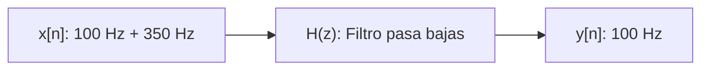
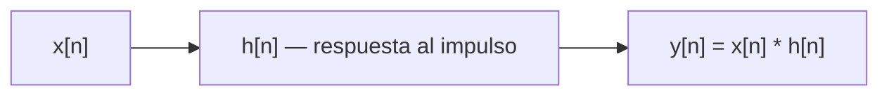
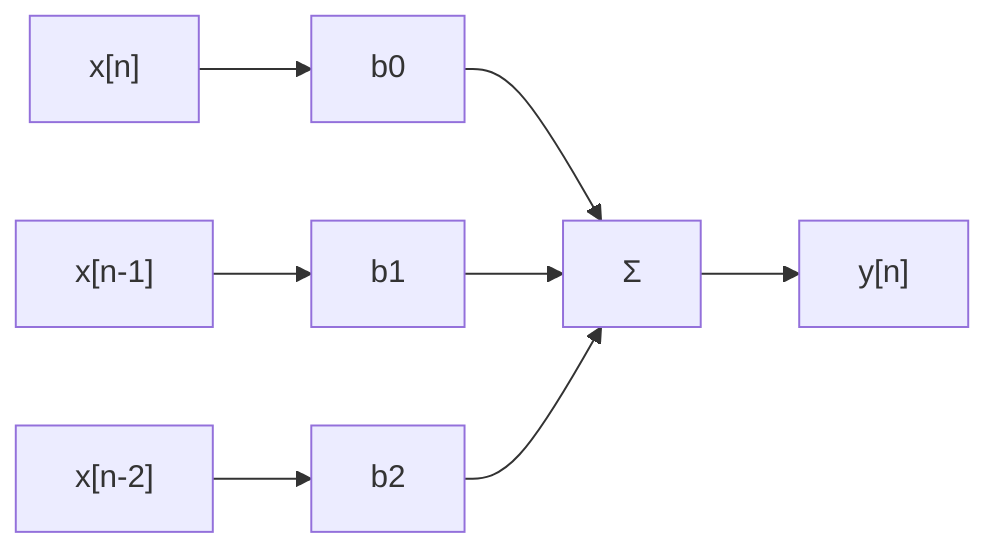
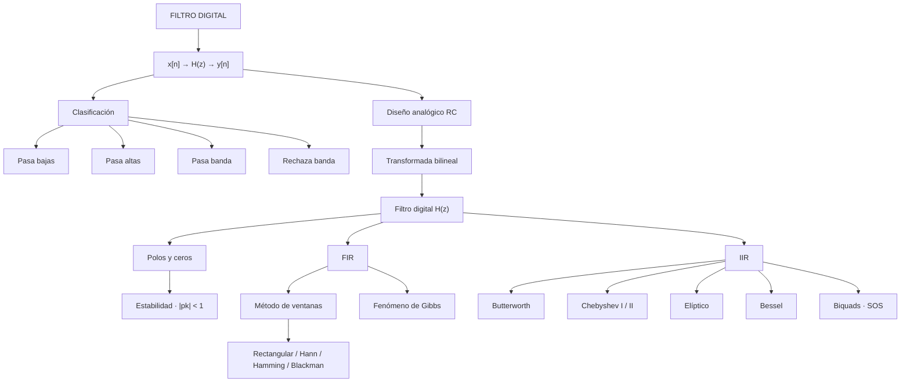

<div align="center">

# 🎛️ Filtros Digitales


**Del circuito RC analógico a la implementación en Python con SciPy**

</div>

---

# 1. 🌐 Concepto de filtro

<div align="center">

## **x[n] → H(z) → y[n]**

> Un filtro modifica selectivamente los **componentes frecuenciales** de una señal.

</div>

**Idea clave:** filtrar es decidir qué frecuencias pasan y cuáles se atenúan.

### Ejemplo mostrado en clase

| Elemento | Valor |
|---|---|
| 🎵 Señal original | 100 Hz + 350 Hz |
| 🔧 Filtro digital | Lowpass |
| ✅ Señal procesada | 100 Hz |



---

# 2. 🧭 Clasificación de filtros

<div align="center">

## **SEGÚN RESPUESTA FRECUENCIAL**

</div>

| Tipo | Deja pasar | Atenúa |
|---|---|---|
| 📉 **Pasa bajas** (Low-pass) | Bajas frecuencias | Altas frecuencias |
| 📈 **Pasa altas** (High-pass) | Altas frecuencias | Bajas frecuencias |
| 🌉 **Pasa banda** (Band-pass) | Una banda intermedia | Fuera de la banda |
| ⛔ **Rechaza banda** (Notch) | Fuera de la banda | Una banda intermedia |

---

# 3. 🔌 Filtro pasa bajas (circuito RC)

<div align="center">

## **RC — LA SALIDA SE TOMA SOBRE EL CAPACITOR**

</div>

### Impedancias

```text
Z_R = R
Z_C = 1 / (sC)
```

### Divisor de voltaje

```text
H(s) = V_out(s) / V_in(s) = Z_C / (R + Z_C)
H(s) = 1 / (1 + sRC)
```

### Frecuencia de corte

| Parámetro | Expresión |
|---|---|
| ω꜀ (rad/s) | 1 / RC |
| f꜀ (Hz) | 1 / (2πRC) |

> A la frecuencia de corte, la ganancia cae **−3 dB** y la fase, **−45°**. Fuera de la banda pasante, la pendiente es de **−20 dB/década**.

---

# 4. 📈 Respuesta en frecuencia

<div align="center">

## **MAGNITUD Y FASE**

</div>

| Magnitud | Fase |
|---|---|
| \|H(jω)\| = 1 / √(1 + (ωRC)²) | ∠H(jω) = −tan⁻¹(ωRC) |


---

# 5. 🧑‍💻 Laboratorio — Filtro pasa bajas en Python

```python
from scipy import signal
import numpy as np
import matplotlib.pyplot as plt

fc = 50
wc = 2 * np.pi * fc
num = wc
den = [1, wc]
h_s = signal.TransferFunction(num, den)  # lti

w, H = signal.freqresp(h_s)
mag, phase = np.abs(H), np.angle(H)

plt.subplot(2, 1, 1)
plt.semilogx(w / (2 * np.pi), 20 * np.log10(mag))
plt.xlabel('Frecuencia [Hz]'); plt.ylabel('Magnitud [dB]')

plt.subplot(2, 1, 2)
plt.semilogx(w / (2 * np.pi), np.degrees(phase))
plt.xlabel('Frecuencia [Hz]'); plt.ylabel('Fase [grados]')
plt.tight_layout(); plt.show()
```

---

# 6. 🔁 Transformada bilineal

<div align="center">

## **DEL PLANO s AL PLANO z**

</div>

Permite pasar de un filtro **analógico** `H(s)` a uno **digital** `H(z)`, conservando la estabilidad.

```python
fs = 1e3          # 1 kHz
ts = 1 / fs
h_d = h_s.to_discrete(ts, method="bilinear")

a = -h_d.den[1:]
b = h_d.num
```

---

# 7. ⚙️ Analógico vs Digital

<div align="center">

## **DOS FORMAS DE FILTRAR**

</div>

| Analógicos | Digitales |
|---|---|
| Continuos | Discretos |
| RLC / Opamps | DSP / MCU |
| Ecuaciones diferenciales | Ecuaciones en diferencias |
| Sensibles a temperatura | Reproducibles |
| Difícil reconfiguración | Reprogramables |

---

# 8. 🌊 Convolución y respuesta al impulso

<div align="center">

## **BASE DEL FILTRADO**

</div>



> La respuesta al impulso `h[n]` **caracteriza completamente** a un sistema LTI.

---

# 9. ⭕ Polos, ceros y estabilidad

<div align="center">

## **z, p, k = signal.tf2zpk(b, a)**

</div>

| Elemento | Efecto |
|---|---|
| 🔵 Ceros | Atenúan frecuencias |
| ❌ Polos | Amplifican / generan resonancia |

### Condición de estabilidad

```text
|pₖ| < 1
```

> Todos los polos deben estar **dentro del círculo unidad**.

```python
z, p, k = signal.tf2zpk(b, a)

plt.scatter(np.real(z), np.imag(z), marker='o', label='Ceros')
plt.scatter(np.real(p), np.imag(p), marker='x', label='Polos')
circle = plt.Circle((0, 0), 1, color='r', fill=False)
plt.gca().add_artist(circle)
plt.legend(); plt.title('Polos y ceros'); plt.show()
```

---

# 10. 📐 Especificaciones de filtros

<div align="center">

## **VOCABULARIO COMÚN A FIR E IIR**

</div>

| Especificación | Significado |
|---|---|
| 🟢 Banda pasante | Frecuencias que el filtro deja pasar |
| 🔴 Banda de rechazo | Frecuencias atenuadas |
| 〰️ Ripple | Ondulación permitida en banda pasante/rechazo |
| 📉 Atenuación | Menos de **−20 dB** se considera atenuado |

> La frecuencia normalizada suele expresarse útil en la FFT.

---

# 11. 🧮 Filtros FIR

<div align="center">

## **FINITE IMPULSE RESPONSE**

### Promedio ponderado del pasado

</div>

```text
y[n] = Σ (k=0 → M) bₖ · x[n − k]
```



### Características

| No recursivos | Solo ceros | Fase lineal | Siempre estables |
|:---:|:---:|:---:|:---:|
| ✅ | ✅ | ✅ | ✅ |

| ✅ Ventajas FIR | ⚠️ Desventajas FIR |
|---|---|
| Estabilidad garantizada | Orden alto |
| Fase lineal | Mayor memoria |
| Robustos numéricamente | Mayor costo computacional |
| Implementación sencilla | — |

**Métodos de diseño:** ventanas · muestreo en frecuencia · Remez (óptimo).
**Importancia:** sistemas embebidos y equipos biomédicos.

---

# 12. 〰️ Fenómeno de Gibbs

<div align="center">

## **PROBLEMA DEL TRUNCAMIENTO**

</div>

> Al truncar la sinc ideal aparecen **oscilaciones cerca del corte**.

### Consecuencias

- Ripple
- Distorsión espectral

---

# 13. 🪟 Método de ventanas

<div align="center">

## **COMPARACIÓN DE VENTANAS**

</div>

| Ventana | Ripple | Atenuación |
|---|:---:|:---:|
| Rectangular | Alto | Baja |
| Hann | Medio | Media |
| Hamming | Bajo | Alta |
| Blackman | Muy bajo | Muy alta |

---

# 14. 🧑‍💻 Laboratorio — FIR con ventana

```python
from scipy.signal import firwin, lfilter, filtfilt

b = firwin(numtaps,            # impar
           cutoff,              # frecuencia de corte
           window='hamming',    # rec | hann | hamming | blackman
           pass_zero="lowpass",
           fs=fs)

y = lfilter(b, [1], x)
y = filtfilt(b, [1], x)
```

---

# 15. ♾️ Filtros IIR

<div align="center">

## **INFINITE IMPULSE RESPONSE**

</div>

**Características:** recursivos · feedback · polos y ceros · menor orden.

| ✅ Ventajas IIR | ⚠️ Desventajas IIR |
|---|---|
| Menor orden | Posible inestabilidad |
| Más eficientes | Fase no lineal |
| Menor memoria | Más sensibles numéricamente |
| Diseño desde filtros analógicos | — |

---

# 16. 🏛️ Familias IIR

<div align="center">

## **PRINCIPALES TIPOS**

</div>

| Familia | Ripple passband | Ripple stopband | Rasgo distintivo |
|---|:---:|:---:|---|
| Butterworth | No | No | Máximamente plano |
| Chebyshev I | Sí | No | Transición abrupta, menor orden |
| Chebyshev II | No | Sí | Banda pasante plana |
| Elíptico | Sí | Sí | Máxima selectividad, orden mínimo |
| Bessel | No | — | Roll-off suave, fase lineal |

---

# 17. 🧑‍💻 Laboratorio — Diseño de filtros IIR

```python
# Butterworth pasa altas @ 200 Hz
b_hp, a_hp = butter(order_iir, 200/nyq, btype='highpass')

# Chebyshev I pasa banda 100-300 Hz (ripple 1 dB)
b_bp, a_bp = cheby1(order_iir, 1, [100/nyq, 300/nyq], btype='bandpass')

# Elíptico rechaza banda 100-300 Hz (ripple 1 dB, atenuación 40 dB)
b_bs, a_bs = ellip(order_iir, 1, 40, [100/nyq, 300/nyq], btype='bandstop')

# SOS (Second-Order Sections) — mayor estabilidad numérica
sos_bs = iirfilter(order_iir, [100/nyq, 300/nyq],
                    btype='bandstop', ftype='butter', output='sos')
```

---

# 18. 🧩 Biquads

<div align="center">

## **SECCIONES DE SEGUNDO ORDEN**

</div>

```text
H(z) = (b0 + b1·z⁻¹ + b2·z⁻²) / (1 + a1·z⁻¹ + a2·z⁻²)
```

| Forma | Característica |
|---|---|
| Direct Form I | Más memoria |
| Direct Form II | Menor memoria |

### ¿Por qué usar biquads?

- Mejor estabilidad numérica
- Implementación robusta
- Uso industrial estándar
- Ideal para DSP embebido

```python
sos = signal.butter(10, 15, 'hp', fs=1000, output='sos')
filtered = signal.sosfilt(sos, sig)
```

---

# 🧠 MAPA CONCEPTUAL FINAL



---

# 📌 CONCLUSIONES

<div align="center">

### **1**
Un **filtro digital** modifica selectivamente las componentes frecuenciales de una señal a través de `H(z)`.

### **2**
El filtro RC analógico y su función de transferencia son la base conceptual del filtrado; la **transformada bilineal** lo lleva al dominio digital.

### **3**
Los **polos y ceros** determinan la forma y la estabilidad de un filtro: todo polo debe estar dentro del círculo unidad.

### **4**
Los filtros **FIR** son siempre estables y de fase lineal, a costa de un orden más alto; se diseñan comúnmente mediante **ventanas**.

### **5**
El **fenómeno de Gibbs** limita el desempeño de una ventana rectangular; ventanas como Hamming o Blackman reducen el ripple a cambio de una transición más ancha.

### **6**
Los filtros **IIR** logran menor orden y mayor eficiencia, pero requieren verificar su estabilidad y suelen implementarse en **familias clásicas** (Butterworth, Chebyshev, Elíptico, Bessel).

### **7**
La implementación en **biquads (SOS)** mejora la robustez numérica frente a la forma directa, y es el estándar en sistemas embebidos.

### **8**
**SciPy (`scipy.signal`)** permite diseñar, analizar y aplicar filtros FIR e IIR de forma práctica sobre señales reales.

</div>

---

# 📚 Referencias

1. Meza Rodriguez, M. *Filtros digitales — Procesamiento Digital de Señales*. Universidad Peruana Cayetano Heredia.
2. Notebook de laboratorio de la clase: [Google Colab — Filtros digitales](https://colab.research.google.com/drive/1XwJO6GgISokFeBpeQhyB3GczDG0CxHIY?usp=sharing)
3. Código completo del filtro pasa bajos: [github.com/MSMRo/DSP_ISB](https://github.com/MSMRo/DSP_ISB/blob/main/NOTEBOOKS/2_systems/filtro_pasabajo.ipynb)
4. Documentación oficial: [SciPy `signal` module](https://docs.scipy.org/doc/scipy/reference/signal.html)

---

<div align="center">

## 🎛️ FILTROS DIGITALES

**CONCEPTO → ANALÓGICO/DIGITAL → FIR → IIR → BIQUADS → LABORATORIO**

### Procesamiento Digital de Señales

</div>
