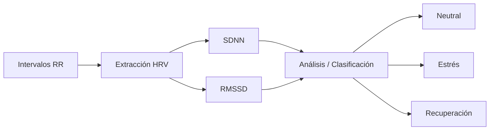
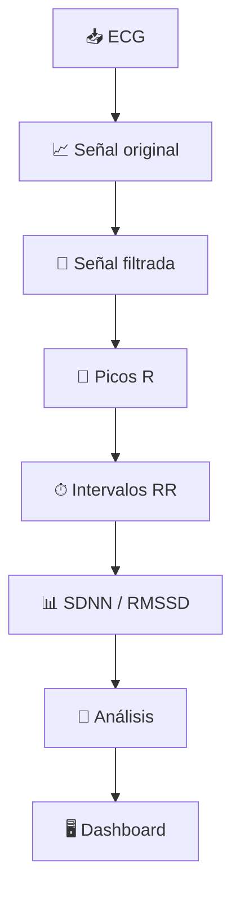
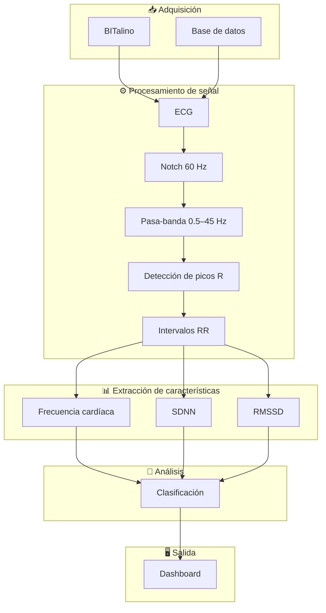
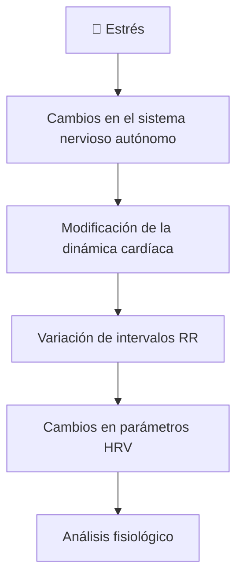

# 🫀 Sistema inteligente de monitoreo de estrés y fatiga mental mediante ECG

### Laboratorio 05 — Introducción a Señales Biomédicas

**Grupo 5**

---

## 📌 Descripción del proyecto

El presente proyecto propone el desarrollo de un sistema para el **monitoreo de indicadores fisiológicos asociados con el estrés y la fatiga mental** mediante el procesamiento de señales electrocardiográficas (**ECG**).

La propuesta se basa en el análisis de la **variabilidad de la frecuencia cardíaca (Heart Rate Variability, HRV)** obtenida a partir de los intervalos entre picos R consecutivos de la señal ECG.

El sistema contempla una cadena de procesamiento compuesta por:

1. adquisición de la señal ECG;
2. preprocesamiento mediante filtros digitales;
3. detección de picos R;
4. cálculo de intervalos RR;
5. extracción de características de HRV;
6. análisis y clasificación de estados fisiológicos; y
7. visualización de resultados mediante una interfaz gráfica.

> **Alcance:** El sistema se plantea como una herramienta académica y experimental para el análisis de señales biomédicas. Los parámetros obtenidos a partir del ECG no constituyen por sí solos un diagnóstico médico o psicológico.

---

# 🔎 1. Planteamiento del problema

El estrés puede producir modificaciones en la actividad del **sistema nervioso autónomo (SNA)** y generar cambios en la dinámica cardiovascular.

Sin embargo, su evaluación suele realizarse mediante cuestionarios, autorreportes o mediciones efectuadas durante periodos limitados.

Estas estrategias presentan algunas limitaciones:

| Limitación | Descripción |
|---|---|
| **Subjetividad** | La evaluación depende de la percepción y respuesta del individuo. |
| **Evaluación reactiva** | El problema puede identificarse después de la aparición de síntomas. |
| **Medición discontinua** | Las evaluaciones aisladas dificultan observar variaciones fisiológicas durante diferentes actividades. |

Por ello, resulta relevante incorporar señales fisiológicas que proporcionen información cuantitativa complementaria y permitan analizar cambios asociados con la respuesta al estrés.

---

# 🎯 2. Objetivo

Desarrollar un sistema de procesamiento de señales ECG capaz de extraer características de variabilidad cardíaca para analizar cambios fisiológicos asociados con estados de reposo, estrés y recuperación.

### Objetivos específicos

- Adquirir señales ECG mediante **BITalino** o utilizar registros de una base de datos.
- Preprocesar la señal mediante filtros digitales.
- Detectar los **picos R** del complejo QRS.
- Calcular los **intervalos RR**.
- Extraer características de HRV como **SDNN** y **RMSSD**.
- Analizar las características obtenidas para diferenciar condiciones fisiológicas.
- Presentar los resultados mediante una **interfaz gráfica o dashboard**.

---

# 💡 3. Propuesta de solución

Se propone implementar un sistema capaz de transformar una señal ECG en indicadores cuantitativos relacionados con la variabilidad cardíaca.

### Flujo general del sistema

**ECG → Filtrado → Picos R → Intervalos RR → HRV → Clasificación → Visualización**

La propuesta integra el procesamiento digital de señales con una herramienta visual que permitirá interpretar los parámetros fisiológicos obtenidos.

---

# 🧠 4. Fundamento fisiológico

La respuesta al estrés está relacionada con modificaciones en la regulación del **sistema nervioso autónomo**.

La interacción entre sus ramas simpática y parasimpática modifica la dinámica del ritmo cardíaco y, por tanto, el tiempo existente entre latidos consecutivos.

En una señal ECG, cada ciclo cardíaco puede identificarse mediante el **pico R** del complejo QRS.

El intervalo entre dos picos R consecutivos se denomina **intervalo RR**:

**Intervalo RR = tiempo del siguiente pico R − tiempo del pico R actual**

La variación temporal de estos intervalos constituye la base para calcular la **variabilidad de la frecuencia cardíaca (HRV)**.

  

  <em>Figura 1. Representación de dos ciclos ECG y del intervalo RR entre picos R consecutivos.</em>

  Fuente: Wikimedia Commons — ECG-RRinterval.svg

---

# ⚙️ 5. Metodología propuesta

## 5.1 Adquisición de la señal ECG

La señal electrocardiográfica constituye la entrada principal del sistema.

Se plantean dos alternativas para disponer de los registros fisiológicos:

### 🔌 BITalino

BITalino permitirá realizar la adquisición experimental de señales ECG mediante electrodos y módulos de instrumentación biomédica.

Este dispositivo proporciona una plataforma orientada a la adquisición y experimentación con diferentes señales fisiológicas, incluyendo ECG.

  

  <em>Figura 2. Plataforma BITalino para adquisición de señales biomédicas.</em>

  Fuente: Wikimedia Commons — BITalino Board

### 📂 Base de datos

Como alternativa o complemento a la adquisición propia, se utilizará una **base de datos con registros ECG asociados con diferentes condiciones fisiológicas**.

El empleo de registros existentes permitirá desarrollar, evaluar y ajustar inicialmente los algoritmos de procesamiento.

### 🔗 Enlace de la base de datos

**WESAD — Wearable Stress and Affect Detection**

Dataset multimodal que contiene registros fisiológicos de 15 participantes, incluyendo ECG, EDA, EMG, respiración, temperatura y aceleración, bajo diferentes estados afectivos.

👉 (https://ubi29.informatik.uni-siegen.de/usi/data_wesad.html)

---

## 5.2 Preprocesamiento de la señal

Las señales ECG pueden contener interferencias provenientes de la red eléctrica, movimiento, ruido instrumental y componentes fuera del rango de interés.

Por ello, antes de realizar la extracción de características se propone una etapa de acondicionamiento digital.

| Procesamiento | Función |
|---|---|
| **Filtro notch de 60 Hz** | Atenuar la interferencia asociada con la frecuencia de la red eléctrica. |
| **Filtro pasa-banda de 0.5–45 Hz** | Conservar las principales componentes de interés del ECG y reducir señales fuera de banda. |

El resultado de esta etapa será una señal ECG acondicionada para facilitar la identificación del complejo QRS y los picos R.

---

## 5.3 Detección de picos R

Después del preprocesamiento se realizará la detección de los **picos R**, correspondientes a uno de los eventos más representativos del complejo QRS.

La ubicación temporal de estos picos permitirá identificar cada latido cardíaco y calcular posteriormente la separación entre latidos consecutivos.

El procedimiento general será:

---

## 5.4 Cálculo de intervalos RR

Una vez detectados los picos R se calculará el tiempo transcurrido entre cada par de picos consecutivos.

**RRᵢ = tiempo del pico Rᵢ₊₁ − tiempo del pico Rᵢ**

La secuencia de intervalos RR permite construir un **tacograma**, donde se representa cómo varía el tiempo entre latidos durante el registro.

Estas variaciones constituyen la entrada principal para el análisis de HRV.

---

## 5.5 Extracción de características HRV

La **variabilidad de la frecuencia cardíaca (HRV)** describe las variaciones temporales existentes entre latidos consecutivos.

  

  <em>Figura 3. Relación entre la señal ECG, los intervalos cardíacos y la variabilidad de la frecuencia cardíaca.</em>

  Fuente: Wikimedia Commons — Heart rate variability (HRV)

En este proyecto se consideran inicialmente dos características temporales:

### 📊 SDNN

**SDNN (Standard Deviation of NN Intervals)** corresponde a la desviación estándar de los intervalos normales entre latidos.

Este indicador permite cuantificar la **variabilidad global** presente en la secuencia de intervalos analizados.

### 📊 RMSSD

**RMSSD (Root Mean Square of Successive Differences)** corresponde a la raíz cuadrática del promedio de las diferencias sucesivas entre intervalos cardíacos.

Este indicador permite analizar principalmente las **variaciones de corto plazo** entre latidos consecutivos.

### Características consideradas

| Característica | Información obtenida |
|---|---|
| **Intervalos RR** | Duración entre latidos consecutivos |
| **Frecuencia cardíaca** | Número de latidos por minuto |
| **SDNN** | Variabilidad global de los intervalos |
| **RMSSD** | Variabilidad de corto plazo |

---

# 🧠 6. Análisis y clasificación

Las características extraídas de la señal ECG serán utilizadas para analizar diferencias entre distintas condiciones fisiológicas.

Inicialmente se consideran tres estados:

| Estado | Descripción |
|---|---|
| 🟢 **Neutral / Reposo** | Condición fisiológica basal o de menor activación. |
| 🔴 **Estrés** | Condición asociada con modificaciones de la regulación autonómica. |
| 🔵 **Recuperación** | Periodo posterior a la condición de estrés. |

La estrategia definitiva de clasificación dependerá del comportamiento de las características y de los datos disponibles durante el desarrollo.

Podrá implementarse mediante:

- reglas basadas en características fisiológicas;
- métodos estadísticos; o
- algoritmos de **Machine Learning**, si los datos obtenidos justifican su utilización.

---

# 🖥️ 7. Frontend propuesto

Todo proyecto finalizará con una **interfaz gráfica o dashboard** que permita visualizar de manera clara los resultados obtenidos durante el procesamiento.

El frontend podrá incluir:

- señal ECG original;
- señal ECG filtrada;
- picos R detectados;
- intervalos RR;
- tacograma;
- frecuencia cardíaca;
- valores de SDNN y RMSSD;
- estado fisiológico identificado; y
- evolución temporal de los indicadores.

El dashboard constituirá la etapa final de integración del sistema y permitirá presentar los resultados del procesamiento de manera comprensible para el usuario.

---

# 🧩 8. Arquitectura general del sistema

---

# 📊 9. Variables principales

| Variable | Descripción | Unidad |
|---|---|---|
| **ECG** | Actividad eléctrica cardíaca registrada | mV |
| **Pico R** | Punto de referencia principal del complejo QRS | — |
| **RR** | Tiempo entre dos picos R consecutivos | ms |
| **HR** | Frecuencia cardíaca | bpm |
| **SDNN** | Desviación estándar de los intervalos NN | ms |
| **RMSSD** | Variabilidad de corto plazo entre intervalos consecutivos | ms |

---

# 📄 10. Paper de referencia

## Stress and Heart Rate Variability: A Meta-Analysis

**Autores:** H.-G. Kim, E.-J. Cheon, D.-S. Bai, Y. H. Lee y B.-H. Koo  
**Revista:** *Psychiatry Investigation*  
**Año:** 2018  
**Volumen:** 15  
**Número:** 3  
**Páginas:** 235–245  
**DOI:** 10.30773/pi.2017.08.17

### ¿Qué estudia?

El artículo analiza investigaciones relacionadas con el **estrés y la variabilidad de la frecuencia cardíaca (HRV)**.

Los autores revisan evidencia sobre las modificaciones de diferentes parámetros de HRV ante situaciones de estrés y su relación con la regulación del sistema nervioso autónomo.

### ¿Por qué es relevante para el proyecto?

El artículo proporciona sustento científico para utilizar características derivadas de la HRV como indicadores fisiológicos relacionados con la respuesta al estrés.

La relación con el proyecto puede resumirse de la siguiente manera:

Por ello, este artículo constituye una referencia principal para justificar la etapa de **extracción y análisis de características HRV**.

---

# 🎥 11. Video de presentación

Como parte del Laboratorio 05 se realizará un video explicativo donde se desarrollarán los principales componentes del proyecto:

- planteamiento del problema;
- propuesta de solución;
- fundamento fisiológico;
- procesamiento de la señal ECG;
- filtros digitales;
- extracción de características HRV;
- propuesta del frontend; y
- explicación del paper científico de referencia.

### ▶️ Enlace del video

> https://drive.google.com/file/d/11WQvK9QtbKBLHI-QzD0Xkgpu8KF4WMqt/view?usp=drivesdk

---

# 📈 12. Resultados esperados

Al finalizar el proyecto se espera implementar una cadena funcional de procesamiento capaz de:

1. adquirir o importar registros ECG;
2. visualizar la señal electrocardiográfica original;
3. aplicar filtros digitales para reducir interferencias;
4. detectar los picos R del ECG;
5. calcular los intervalos RR;
6. generar la información temporal necesaria para el análisis HRV;
7. calcular parámetros como **SDNN y RMSSD**;
8. analizar diferencias entre estados fisiológicos;
9. implementar una estrategia de clasificación; y
10. presentar los resultados mediante un **dashboard interactivo**.

El resultado esperado es una herramienta académica funcional que integre **adquisición, procesamiento digital, extracción de características, análisis y visualización** de señales electrocardiográficas.

---

# 📚 Referencias

**[1]** World Health Organization and International Labour Organization,  
"Mental health at work: policy brief," *World Health Organization*, Geneva, Switzerland, Tech. Rep. WHO/MSD/HSM/2022.1, 2022.

**[2]** S. Cohen, T. Kamarck, and R. Mermelstein,  
"A global measure of perceived stress," *J. Health Soc. Behav.*, vol. 24, no. 4, pp. 385–396, Dec. 1983.

**[3]** H.-G. Kim, E.-J. Cheon, D.-S. Bai, Y. H. Lee, and B.-H. Koo,  
"Stress and heart rate variability: A meta-analysis," *Psychiatr. Investig.*, vol. 15, no. 3, pp. 235–245, Mar. 2018. doi: 10.30773/pi.2017.08.17.

**[4]** Task Force of the European Society of Cardiology and the North American Society of Pacing and Electrophysiology,  
"Heart rate variability: Standards of measurement, physiological interpretation, and clinical use," *Circulation*, vol. 93, no. 5, pp. 1043–1065, Mar. 1996.

---

## Grupo 5

### Introducción a Señales Biomédicas

🫀 **ECG → Filtrado → HRV → Análisis → Dashboard**

