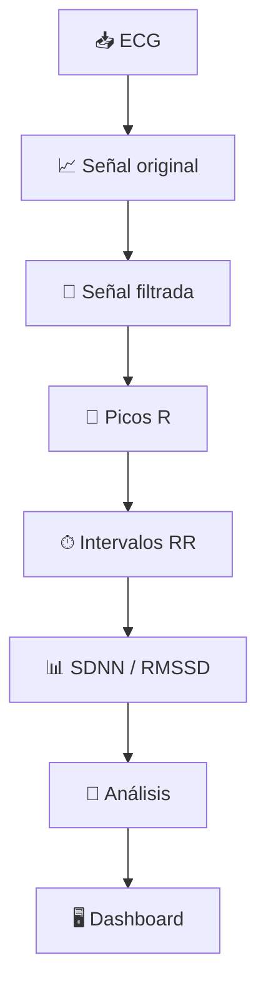
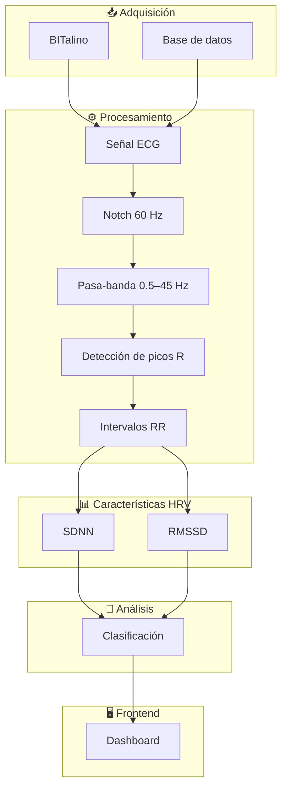

<div align="center">

# 🫀 Sistema inteligente de monitoreo de estrés y fatiga mental mediante ECG

### Laboratorio 05 — Introducción a Señales Biomédicas

**Grupo 5**


</div>

---

## 📌 Descripción del proyecto

El presente proyecto propone el desarrollo de un sistema para el **monitoreo de indicadores fisiológicos asociados con el estrés y la fatiga mental** mediante el procesamiento de señales electrocardiográficas (**ECG**).

La propuesta se basa en el análisis de la **variabilidad de la frecuencia cardíaca (Heart Rate Variability, HRV)** obtenida a partir de los intervalos entre picos R consecutivos de la señal ECG.

Para ello, se plantea una cadena de procesamiento que comprende:

1. adquisición de la señal ECG;
2. preprocesamiento mediante filtros digitales;
3. detección de picos R;
4. cálculo de intervalos RR;
5. extracción de características de HRV;
6. análisis y clasificación de estados fisiológicos; y
7. visualización de resultados mediante una interfaz gráfica.

> **Alcance:** El sistema se plantea como una herramienta académica y experimental para el análisis de señales biomédicas. Los indicadores derivados del ECG no constituyen por sí solos un diagnóstico médico o psicológico.

---

# 🔎 1. Planteamiento del problema

El estrés constituye una respuesta fisiológica frente a diferentes demandas del entorno y puede generar modificaciones en la actividad del **sistema nervioso autónomo**, reflejándose en cambios de la dinámica cardiovascular.

Sin embargo, su evaluación suele realizarse mediante cuestionarios, autorreportes o mediciones efectuadas durante periodos limitados.

Estas estrategias presentan algunas limitaciones:

| Limitación | Descripción |
|---|---|
| **Subjetividad** | La evaluación puede depender de la percepción y respuesta de la persona. |
| **Evaluación reactiva** | El problema puede identificarse después de la aparición de síntomas. |
| **Medición discontinua** | Las evaluaciones aisladas dificultan observar cambios fisiológicos durante diferentes actividades. |

Por ello, resulta relevante explorar métodos cuantitativos basados en señales fisiológicas que complementen la evaluación tradicional y permitan analizar cambios asociados con la respuesta al estrés.

---

# 🎯 2. Objetivo

Desarrollar un sistema de procesamiento de señales ECG capaz de extraer características de variabilidad cardíaca para analizar cambios fisiológicos asociados con estados de reposo, estrés y recuperación.

### Objetivos específicos

- Adquirir señales ECG mediante **BITalino** o utilizar registros de una base de datos.
- Preprocesar la señal mediante filtros digitales.
- Detectar los **picos R** del complejo QRS.
- Calcular los **intervalos RR**.
- Extraer características de HRV como **SDNN** y **RMSSD**.
- Analizar las características obtenidas para diferenciar condiciones fisiológicas.
- Presentar los resultados mediante una **interfaz gráfica o dashboard**.

---

# 💡 3. Propuesta de solución

Se propone implementar un sistema capaz de transformar una señal ECG en indicadores cuantitativos relacionados con la variabilidad cardíaca.

La cadena general de procesamiento será:


### Flujo general

**ECG → Filtrado → Picos R → Intervalos RR → HRV → Clasificación → Visualización**

La propuesta busca integrar el procesamiento digital de señales con una herramienta visual que permita interpretar los parámetros obtenidos de forma clara.

---

# 🧠 4. Fundamento fisiológico

La respuesta al estrés está relacionada con cambios en la regulación del **sistema nervioso autónomo (SNA)**.

La interacción entre las ramas simpática y parasimpática modifica la dinámica del ritmo cardíaco y, por lo tanto, el tiempo existente entre latidos consecutivos.

En una señal ECG, cada ciclo cardíaco puede identificarse mediante el **pico R** del complejo QRS.

El intervalo entre dos picos R consecutivos se define como:

\[
RR_i = t_{R_{i+1}} - t_{R_i}
\]

donde:

- \(t_{R_i}\): instante correspondiente al pico R actual.
- \(t_{R_{i+1}}\): instante correspondiente al siguiente pico R.
- \(RR_i\): intervalo temporal entre ambos latidos.

La variación de estos intervalos constituye la base para calcular la **variabilidad de la frecuencia cardíaca (HRV)**.

---

# ⚙️ 5. Metodología propuesta

## 5.1 Adquisición de la señal ECG

La señal electrocardiográfica constituye la entrada principal del sistema.

Se plantean dos alternativas de adquisición:

### 🔌 BITalino

BITalino permitirá realizar registros experimentales de ECG mediante electrodos y módulos de adquisición de señales biomédicas.

### 📂 Base de datos

También se contempla el uso de una **base de datos de señales fisiológicas** que contenga registros ECG asociados con diferentes condiciones experimentales.

Esto permitirá evaluar inicialmente los algoritmos de procesamiento antes o durante la adquisición de registros propios.

### 🔗 Enlace de la base de datos

**Pendiente de adjuntar.**

> El enlace definitivo de la base de datos utilizada será incorporado cuando se establezca la fuente de datos final del proyecto.

---

## 5.2 Preprocesamiento

Las señales ECG pueden contener ruido, interferencias eléctricas y componentes no deseados que dificultan la identificación de las características cardíacas.

Por ello, se propone realizar una etapa de acondicionamiento digital.

| Procesamiento | Función |
|---|---|
| **Filtro notch de 60 Hz** | Atenuar la interferencia asociada con la red eléctrica. |
| **Filtro pasa-banda de 0.5–45 Hz** | Conservar las componentes principales del ECG y reducir señales fuera del rango de interés. |


### Figura del preprocesamiento

<p align="center">
  
</p>

<p align="center">
  <em>Figura 1. Ejemplo del preprocesamiento de la señal ECG.</em>
</p>

---

## 5.3 Detección de picos R

Después del filtrado se realizará la detección de los **picos R**, correspondientes a los eventos más representativos del complejo QRS.

La ubicación temporal de estos picos permitirá identificar cada ciclo cardíaco y posteriormente calcular los intervalos RR.

<p align="center">
  
</p>

<p align="center">
  <em>Figura 2. Identificación de picos R e intervalos RR en una señal ECG.</em>
</p>

---

## 5.4 Cálculo de intervalos RR

Una vez identificados los picos R, se calculará la diferencia temporal entre eventos consecutivos:

\[
RR_i = t_{R_{i+1}} - t_{R_i}
\]

La secuencia obtenida permite construir un **tacograma RR**, utilizado para estudiar la variabilidad del ritmo cardíaco.

```text
R₁            R₂               R₃
│             │                │
▼             ▼                ▼
│<--- RR₁ --->│<---- RR₂ ----->│
```

---

## 5.5 Extracción de características

A partir de los intervalos RR se calcularán parámetros de **variabilidad de la frecuencia cardíaca (HRV)**.

Inicialmente se consideran dos características temporales principales:

### 📊 SDNN

Corresponde a la desviación estándar de los intervalos NN:

\[
SDNN =
\sqrt{
\frac{1}{N-1}
\sum_{i=1}^{N}
(RR_i-\overline{RR})^2
}
\]

Permite cuantificar la variabilidad global de los intervalos cardíacos analizados.

---

### 📊 RMSSD

Corresponde a la raíz cuadrática de la media de las diferencias cuadráticas entre intervalos consecutivos:

\[
RMSSD =
\sqrt{
\frac{1}{N-1}
\sum_{i=1}^{N-1}
(RR_{i+1}-RR_i)^2
}
\]

Este parámetro permite analizar variaciones de corto plazo entre latidos consecutivos.

---

# 🧠 6. Análisis y clasificación

Las características obtenidas serán utilizadas para estudiar diferencias entre distintas condiciones fisiológicas.

Inicialmente se consideran tres estados:

| Estado | Descripción |
|---|---|
| 🟢 **Neutral / Reposo** | Condición fisiológica basal. |
| 🔴 **Estrés** | Condición asociada con cambios de la regulación autonómica. |
| 🔵 **Recuperación** | Periodo posterior a la condición de estrés. |

La clasificación definitiva dependerá del comportamiento de las características extraídas y de los datos disponibles.

La etapa podrá implementarse mediante:

- criterios basados en características;
- métodos estadísticos; o
- modelos de **Machine Learning**, si los datos y resultados obtenidos justifican su aplicación.

---

# 🖥️ 7. Frontend propuesto

El proyecto finalizará con el desarrollo de una **interfaz gráfica o dashboard** que permita visualizar de manera clara los resultados obtenidos.

La interfaz podrá presentar:

- señal ECG original;
- señal ECG filtrada;
- picos R detectados;
- intervalos RR;
- tacograma;
- frecuencia cardíaca;
- valores de SDNN y RMSSD;
- estado fisiológico analizado; y
- evolución temporal de los indicadores.



### Figura del frontend

<p align="center">
  
</p>

<p align="center">
  <em>Figura 3. Representación conceptual de la interfaz final del sistema.</em>
</p>

---

# 🧩 8. Arquitectura general



---

# 📊 9. Variables principales

| Variable | Descripción | Unidad |
|---|---|---|
| **ECG** | Actividad eléctrica cardíaca registrada | mV |
| **Pico R** | Punto de referencia del complejo QRS | — |
| **RR** | Tiempo entre picos R consecutivos | ms |
| **HR** | Frecuencia cardíaca | bpm |
| **SDNN** | Desviación estándar de intervalos NN | ms |
| **RMSSD** | Variabilidad entre intervalos consecutivos | ms |

---

# 📄 10. Paper de referencia

## Stress and Heart Rate Variability: A Meta-Analysis

**Autores:** H.-G. Kim, E.-J. Cheon, D.-S. Bai, Y. H. Lee y B.-H. Koo  
**Revista:** *Psychiatry Investigation*  
**Año:** 2018  
**Volumen:** 15  
**Número:** 3  
**Páginas:** 235–245  
**DOI:** 10.30773/pi.2017.08.17

### ¿Qué estudia?

El artículo analiza investigaciones relacionadas con el **estrés psicológico y la variabilidad de la frecuencia cardíaca (HRV)**.

La revisión estudia cómo diferentes situaciones de estrés producen modificaciones en parámetros relacionados con la regulación autonómica cardíaca.

### ¿Cuál es su aporte al proyecto?

Este trabajo proporciona sustento científico para utilizar la **HRV como una variable fisiológica relacionada con la respuesta al estrés**.

Su relación con la propuesta puede resumirse mediante:

```text
Estrés
   ↓
Cambios en el sistema nervioso autónomo
   ↓
Modificación del ritmo cardíaco
   ↓
Variación de los intervalos RR
   ↓
Cambios en parámetros HRV
   ↓
Análisis fisiológico del estrés
```

Por ello, el artículo constituye una referencia importante para justificar la etapa de **extracción y análisis de características HRV** del sistema propuesto.

---

# 🎥 11. Video de presentación

El video correspondiente al Laboratorio 05 incluirá la explicación de:

- planteamiento del problema;
- propuesta de solución;
- fundamento fisiológico;
- procesamiento de la señal ECG;
- extracción de características HRV;
- propuesta de frontend; y
- explicación del paper científico de referencia.

### ▶️ Video del proyecto

**Pendiente de adjuntar.**

> El enlace de YouTube o Google Drive será incorporado una vez finalizada y publicada la presentación del Grupo 5.

---

# 📈 12. Resultados esperados

Al finalizar el proyecto se espera contar con una cadena de procesamiento capaz de:

1. Adquirir o importar una señal ECG.
2. Visualizar la señal original.
3. Aplicar filtros digitales para reducir interferencias.
4. Detectar los picos R.
5. Calcular los intervalos RR.
6. Construir el tacograma.
7. Obtener parámetros HRV como SDNN y RMSSD.
8. Analizar diferencias entre diferentes estados fisiológicos.
9. Implementar una estrategia de clasificación.
10. Visualizar los resultados mediante un frontend.

---

# ✅ 13. Cumplimiento de los requisitos del proyecto

| Requisito | Propuesta |
|---|---|
| **Señal biomédica** | ✅ ECG / EKG |
| **Procesamiento digital** | ✅ Incluido |
| **Filtros digitales** | ✅ Notch 60 Hz + pasa-banda 0.5–45 Hz |
| **Extracción de características** | ✅ RR, SDNN y RMSSD |
| **Adquisición propia** | ✅ BITalino como alternativa |
| **Base de datos** | ✅ Considerada |
| **Enlace de base de datos** | ⏳ Pendiente de adjuntar |
| **Análisis / clasificación** | ✅ Incluido |
| **Machine Learning** | 🔄 Opcional según los resultados |
| **Frontend** | ✅ Dashboard |
| **Paper científico** | ✅ Incluido |
| **Explicación del paper** | ✅ Incluida |
| **Video** | ⏳ Pendiente de adjuntar |
| **Presentación en Markdown** | ✅ Incluida en GitHub |

---

# 🗂️ 14. Estructura propuesta del repositorio

```text
Laboratorio-05/
│
├── README.md
│
├── data/
│   ├── raw/
│   └── processed/
│
├── docs/
│   └── images/
│       ├── ecg_filtrado.png
│       ├── picos_r.png
│       └── dashboard.png
│
├── src/
│   ├── preprocessing/
│   ├── peak_detection/
│   ├── hrv/
│   ├── classification/
│   └── frontend/
│
├── notebooks/
│
└── results/
```

---

# 🔬 15. Alcance del proyecto

El proyecto se encuentra orientado al **procesamiento y análisis experimental de señales electrocardiográficas**.

Comprende:

- adquisición o importación de ECG;
- acondicionamiento y filtrado digital;
- detección de picos R;
- cálculo de intervalos RR;
- extracción de parámetros HRV;
- análisis de estados fisiológicos; y
- visualización mediante una interfaz gráfica.

La propuesta busca mantener un alcance técnicamente viable para su desarrollo durante el ciclo académico, priorizando una cadena de procesamiento completa y funcional.

---

# 📚 16. Referencias

[1] World Health Organization and International Labour Organization,  
"Mental health at work: policy brief," *World Health Organization*, Geneva, Switzerland, Tech. Rep. WHO/MSD/HSM/2022.1, 2022.

[2] S. Cohen, T. Kamarck, and R. Mermelstein,  
"A global measure of perceived stress," *J. Health Soc. Behav.*, vol. 24, no. 4, pp. 385–396, Dec. 1983.

[3] H.-G. Kim, E.-J. Cheon, D.-S. Bai, Y. H. Lee, and B.-H. Koo,  
"Stress and heart rate variability: A meta-analysis," *Psychiatr. Investig.*, vol. 15, no. 3, pp. 235–245, Mar. 2018. doi: 10.30773/pi.2017.08.17.

[4] Task Force of the European Society of Cardiology and the North American Society of Pacing and Electrophysiology,  
"Heart rate variability: Standards of measurement, physiological interpretation, and clinical use," *Circulation*, vol. 93, no. 5, pp. 1043–1065, Mar. 1996.

---

<div align="center">

## Grupo 5

### Introducción a Señales Biomédicas

🫀 **ECG → Filtrado → HRV → Análisis → Dashboard**

</div>
