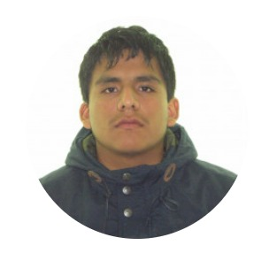
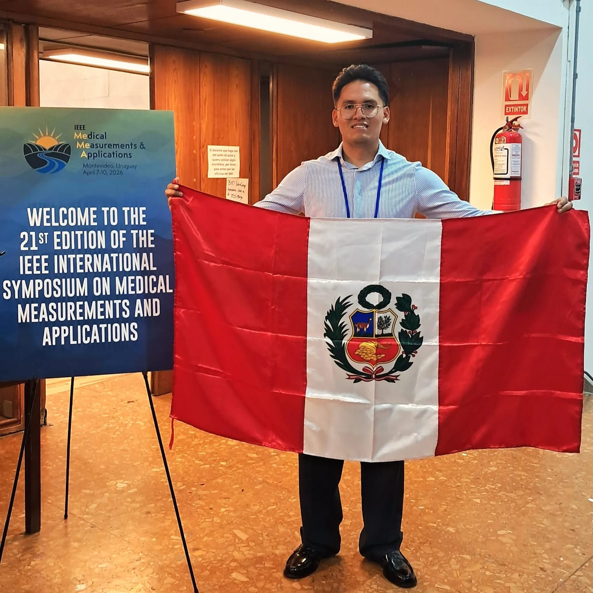
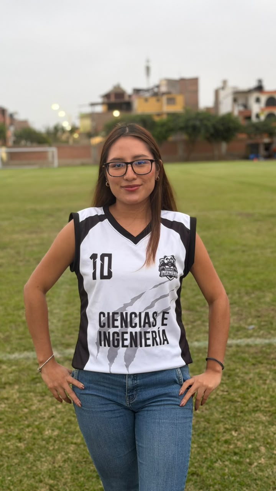
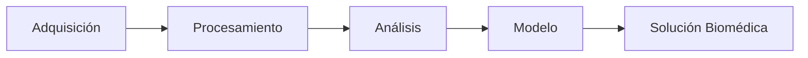

# 🫀 Grupo 5 | Introducción a Señales Biomédicas (ISB 2026-II)

<p align="center">


</p>


<p align="center">

</p>


---

# 📌 Sobre el repositorio

Bienvenido al repositorio oficial del **Grupo 5** del curso:

> **Introducción a Señales Biomédicas (C1132)**  
> Ingeniería Biomédica — Universidad Peruana Cayetano Heredia

Este espacio contiene los laboratorios, códigos, documentación y avances desarrollados durante el semestre **2026-II**, aplicando herramientas de programación, adquisición y procesamiento digital de señales biomédicas.

El curso aborda el estudio de señales provenientes de dispositivos médicos, incluyendo sensores, adquisición de datos, procesamiento computacional y desarrollo de soluciones biomédicas mediante programación y prototipos.


---

# 🎯 Objetivos del equipo

Nuestro trabajo busca integrar conocimientos de ingeniería para:

🫀 Analizar señales fisiológicas humanas  
📡 Adquirir datos mediante sensores biomédicos  
💻 Implementar algoritmos utilizando Python  
📊 Procesar señales digitales  
🤖 Aplicar modelos computacionales y Machine Learning  
🔬 Desarrollar soluciones orientadas al área de salud


---

# 🧬 Señales biomédicas estudiadas


| Señal | Descripción | Aplicación |
|:---:|---|---|
| 🫀 ECG | Electrocardiograma | Análisis de actividad cardíaca |
| 💪 EMG | Electromiograma | Evaluación de actividad muscular |
| 🧠 EEG | Electroencefalograma | Estudio de actividad cerebral |


---

# 📂 Organización del repositorio


```text
.
├── 📁 Laboratorios
│   ├── Lab_01_Git_GitHub_VSCode
│   ├── Lab_02_Adquisición_de_señales
│   ├── Lab_03_Procesamiento
│   └── Otros laboratorios
│
├── 📁 Proyecto_Final
│   ├── Código
│   ├── Datos
│   ├── Documentación
│   └── Resultados
│
├── 📁 assets
│   ├── ECG.gif
│   ├── leonardo.jpeg
│   ├── aylee.jpeg
│   ├── kevin.jpeg
│   └── carla.jpeg
│
└── README.md
```


---

# 👥 Integrantes del equipo


<table>

<tr>

<td align="center">



<br>

<b>Leonardo Fabio Gómez Hormaza</b>

<br>

Ingeniería Biomédica  
<br>
Ciclo 9

<br>

<a href="mailto:leonardo.gomez@upch.pe">
✉️ leonardo.gomez@upch.pe
</a>

</td>


<td align="center">


<br>

<b>Aylee Maria Fernanda Simeon Quispe</b>

<br>

Ingeniería Biomédica  
<br>
Ciclo 8

<br>

<a href="mailto:aylee.simeon@upch.pe">
✉️ aylee.simeon@upch.pe
</a>

</td>


<td align="center">



<br>

<b>Kevin Bryan Vila Jara</b>

<br>

Ingeniería Biomédica  
<br>
Ciclo 10

<br>

<a href="mailto:kevin.vila@upch.pe">
✉️ kevin.vila@upch.pe
</a>

</td>


<td align="center">



<br>

<b>Carla Ariana Bravo Palacios</b>

<br>

Ingeniería Biomédica  
<br>
Ciclo 8

<br>

<a href="mailto:carla.bravo@upch.pe">
✉️ carla.bravo@upch.pe
</a>

</td>

</tr>

</table>


---

# 🛠️ Herramientas utilizadas


<p align="center">


</p>


| Herramienta | Uso dentro del proyecto |
|---|---|
| 🐍 Python | Procesamiento y análisis de señales |
| 🐙 Git | Control de versiones |
| ☁️ GitHub | Trabajo colaborativo y almacenamiento remoto |
| 💻 VS Code | Desarrollo y gestión del código |
| 🔌 Arduino | Adquisición mediante sensores |


---

# 📚 Contenido del curso


## Unidad 1 — Introducción y adquisición de señales

- Características de señales biomédicas
- Sensores y adquisición
- Señales ECG, EMG y EEG
- Filtros FIR e IIR


## Unidad 2 — Procesamiento y análisis

- Tratamiento de señales ECG
- Tratamiento de señales EMG
- Tratamiento de señales EEG
- Extracción de características


## Unidad 3 — Informática biomédica

- Machine Learning aplicado a señales
- Desarrollo del proyecto final
- Presentación de resultados


---

# 🚀 Flujo de desarrollo del proyecto


```text
Problema biomédico
        │
        ▼
Adquisición de señales
        │
        ▼
Procesamiento digital
        │
        ▼
Extracción de características
        │
        ▼
Modelo computacional
        │
        ▼
Prototipo biomédico
```


---

# 🔬 Proyecto Final


Durante el semestre desarrollaremos un proyecto basado en señales biomédicas siguiendo una metodología de ingeniería:

✔ Identificación del problema  
✔ Diseño de solución  
✔ Implementación computacional  
✔ Validación experimental  
✔ Presentación de resultados  


---

# 📈 Metodología de trabajo





---

# 📎 Enlaces importantes


📘 Documentación del curso  
📂 Laboratorios  
🧪 Proyecto final  
📊 Resultados y evidencias  


---

# 👨‍💻 Control de versiones


Este repositorio utiliza:

```
Git
 +
GitHub
 +
Visual Studio Code
```

para mantener un historial organizado, facilitar la colaboración y documentar cada etapa del desarrollo.


---

<p align="center">

🫀 **Transformando señales biomédicas en soluciones para la salud** 🚀

</p>


<p align="center">

Grupo 5 — ISB 2026-II

</p>
